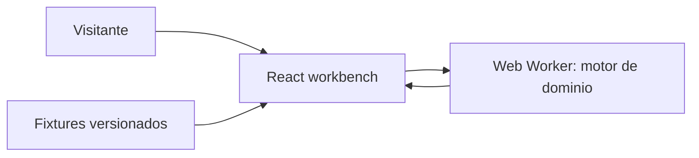

# SLO/Error Budget Calculator

Define un SLI, un objetivo (SLO) y una ventana de medición para calcular el presupuesto de error, simular
burn rate ante incidentes y comparar objetivos entre sí — con los supuestos y el nivel de confianza del
cálculo siempre visibles, nunca solo un número.

**Problema:** los porcentajes de disponibilidad ("99.9% uptime") no muestran cuánta indisponibilidad
queda realmente ni cuándo hay que detener despliegues. Este proyecto traduce ese porcentaje a tiempo y a
una decisión operativa concreta.

## Demo

- Producción: `https://slo-error-budget-calculator.pages.dev` (el dominio
  `https://slo-error-budget-calculator.alexcuesta.dev` quedará activo cuando el orquestador del
  portafolio adjunte el DNS).
- Recorrido de 30 segundos: se abre con un fixture precargado. Pulsa **Ejecutar escenario** para ver
  presupuesto, burn rate y decisiones explicadas.
- Recorrido de 90 segundos: abre un hallazgo, cambia el objetivo (SLO) o añade un evento de incidente,
  vuelve a ejecutar y exporta la evidencia (JSON o Markdown).

## Inicio local

```bash
pnpm install
pnpm dev            # http://localhost:5173
pnpm build           # build de producción a dist/
pnpm preview          # sirve dist/ en 127.0.0.1:20724
```

## Comandos de calidad

```bash
pnpm typecheck
pnpm lint
pnpm test            # unit + contrato (Vitest)
pnpm test:e2e         # E2E + accesibilidad axe (Playwright, requiere build previo)
```

## Arquitectura

Aplicación 100% estática: React + TypeScript en el navegador, cálculo determinista en un Web Worker
cancelable, sin backend propio. Ningún dato sale del dispositivo.



- `src/domain/` — reglas puras: `calculateBudget`, `simulateBurn`, `compareObjectives`,
  `explainDecisions`, el validador manual del contrato y el motor de orquestación (`engine.ts`).
- `src/worker/` — protocolo de mensajes hacia el Web Worker, con cancelación cooperativa.
- `src/fixtures/` — escenarios versionados: feliz, límite, adversarial y "adaptador no disponible".
- `src/ui/` — componentes React, formulario editable y hook de ejecución.
- `contracts/` — `input.schema.json` y `output.schema.json`, fuente de verdad de tipos.

### Por qué no se usa `ajv` en el navegador

`ajv.compile()` genera código con `new Function(...)`, incompatible con una CSP estricta
(`script-src 'self'`, sin `unsafe-eval`). El validador de `contracts/input.schema.json` está escrito a
mano en `src/domain/validation.ts`. `ajv` solo se usa como dependencia de desarrollo, en
`src/domain/__tests__/contract.test.ts`, para comprobar que el validador manual no diverge del schema
publicado.

## Fixtures

| Escenario | Qué demuestra |
|---|---|
| `happy-path` | Presupuesto saludable, un incidente moderado, comparación de objetivos. |
| `boundary` | Ventana máxima (365 días), objetivo casi perfecto y 10 comparaciones (límite exacto). |
| `adversarial` | Contenido hostil (intento de XSS) en campos de texto y burn rate crítico. |
| `dependency-down` | Fallback a modo determinista local cuando un adaptador externo no está disponible. |
| `invalid-input` | Objetivo del 100% y ventana fuera de rango: debe fallar con un mensaje accionable. |

## Seguridad

- CSP restrictiva vía `public/_headers` (`script-src 'self'`, sin `unsafe-eval`), `X-Content-Type-Options:
  nosniff`, `Referrer-Policy`, `X-Frame-Options: DENY`, `Permissions-Policy` restrictiva.
- Nunca se usa `innerHTML` ni se ejecuta contenido pegado por el visitante (ver fixture `adversarial`).
- Validación estricta con límites de tamaño/cantidad/profundidad antes de calcular nada.
- La exportación excluye el payload de entrada por defecto (ver `exportPolicy()` en
  `src/domain/export.ts`) y fuerza descarga de archivo en vez de navegación in-place.
- No se registran payloads, tokens ni cabeceras; no hay analítica en este MVP.

## Accesibilidad

- HTML nativo antes que ARIA; encabezados y landmarks coherentes; foco visible de 2px.
- Toda gráfica (burn rate) tiene una tabla equivalente visible, no oculta ni opcional.
- `prefers-reduced-motion` respetado.
- Verificado con axe-core en CI (cero violaciones serias/críticas) y navegación completa por teclado en
  el E2E principal.

## Límites honestos

- El objetivo (SLO) nunca puede ser 100%: la app lo rechaza explícitamente con un mensaje, en vez de
  aceptarlo como una meta válida.
- La confianza del cálculo (`alta`/`media`/`baja`) depende del tamaño de la muestra del SLI; con pocos
  eventos, el resultado se marca como orientativo, no como medición operativa.
- No hay adaptador real a un proveedor de métricas: el modo determinista con fixtures es el único modo
  soportado en producción (ver ADR-003 en `05-arquitectura-tecnica.md`).
- Sin cuentas, sin persistencia remota; la sesión vive en memoria del navegador.

## Pruebas como sustituto de las "5 pruebas observadas"

No hubo usuarios humanos disponibles para observar en este entorno automatizado. En su lugar, el
recorrido feliz de 30/90s y dos casos límite/adversariales quedaron codificados como pruebas E2E
reproducibles (`e2e/happy-path.spec.ts`, `e2e/adversarial-and-errors.spec.ts`,
`e2e/accessibility.spec.ts`), que corren en cada push vía CI. Esto es honesto: es un sustituto
automatizado, no una validación con usuarios reales.

## Decisiones

Ver `15-registro-decisiones.md` para los ADR y supuestos completos. Resumen:

- **Sin VPS:** Cloudflare Pages, aplicación estática, GitHub Pages como salida alternativa.
- **Núcleo funcional:** las reglas de dominio son funciones puras, independientes de React.
- **Evidencia primero:** cada ejecución genera un `runId`, versión de reglas y lista de decisiones
  explicadas, exportables sin crear cuenta.

## Documentación completa del proyecto

Este repositorio incluye el paquete de especificación completo usado para construirlo: `00` a `16`
(PRD, UX, arquitectura, modelo de datos, contratos, seguridad, pruebas, despliegue, lanzamiento,
presentación, trazabilidad y decisiones).
